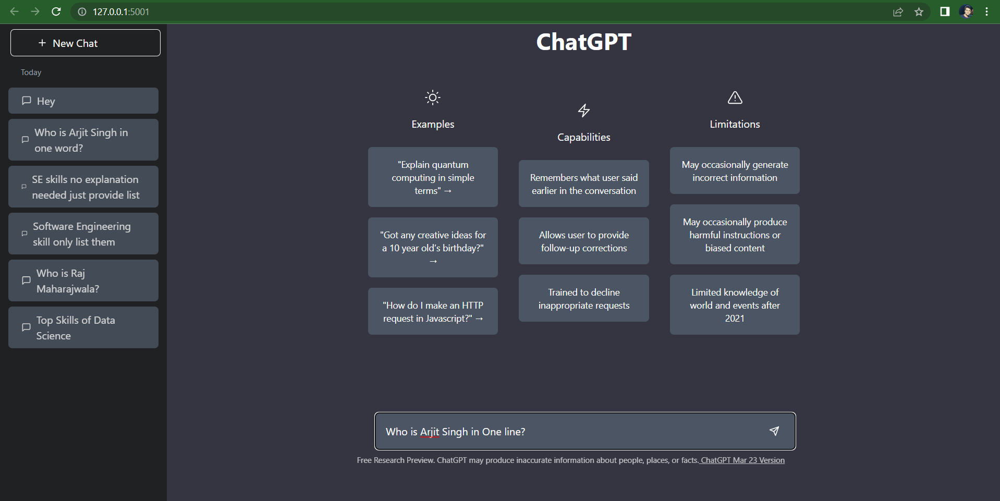
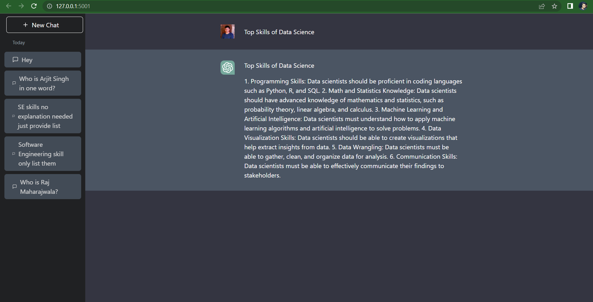

# Project: ChatGPT Clone

## Screenshots

## Creating Virtual Environment:
    1. python -m venv venv
    2. venv\Scripts\activate
    3. pip install -r requirements.txt

## Test the basic Flask app with render_template index.html

## Install NodeJS Binary File if it is not installed:
    1. Link: https://nodejs.org/en/download
    2. Check Version node -v

## Configure
    1. npm init -y
    2. npm i tailwindcss
    3. npx tailwindcss init

## Create and add 3 lines to static/input.css
    @tailwind base;
    @tailwind components;
    @tailwind utilities;

## Create static/css/main.css

## npx tailwindcss -i ./static/input.css -o ./static/css/main.css --watch
(This commad will fill up the main.css)

## After this copy the above command and add it to package.json
npm run tailwind (Now no need to type long commad just this and it will run in the terminal)

## Now add link to main.css in index.html
And run python main.py in other terminal

## https://chat.openai.com/favicon.ico
